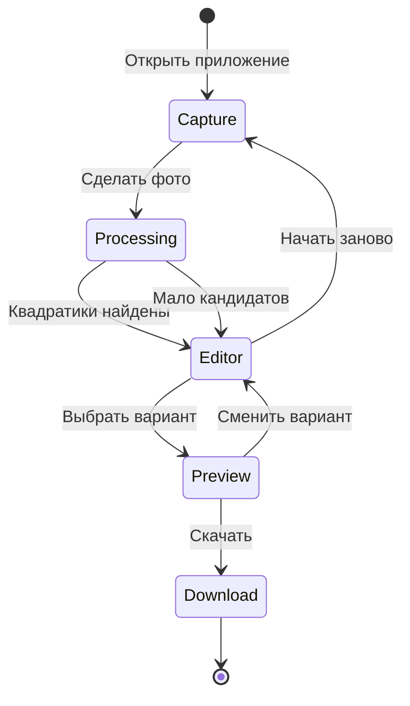

# Этап 7. UI/UX и пользовательский поток

Обзор проекта: [golosuy_web_service_f33e701e.plan.md](golosuy_web_service_f33e701e.plan.md)

## Задачи

- Экраны: Захват → Обработка (спиннер + «Загрузка OpenCV…») → Редактор (рамки + список вариантов) → Превью → Скачивание
- Редактор объединяет детекцию и выбор: пользователь видит рамки на фото и выбирает квадратик (тап или список)
- Подключить [`pipeline.ts`](../../src/lib/pipeline.ts) в [`App.tsx`](../../src/App.tsx)
- Экспорт: `drawMark` → `exportCanvasToJpegWithExif` из [`preserveExif.ts`](../../src/lib/exif/preserveExif.ts)
- Русскоязычный интерфейс
- Подсказки: «Снимайте крупным планом», «Обеспечьте хорошее освещение»
- Кнопка «Начать заново» на любом шаге
- Fallback в редакторе: ручной тап для уточнения позиции квадратика (без коррекции углов бюллетеня)
