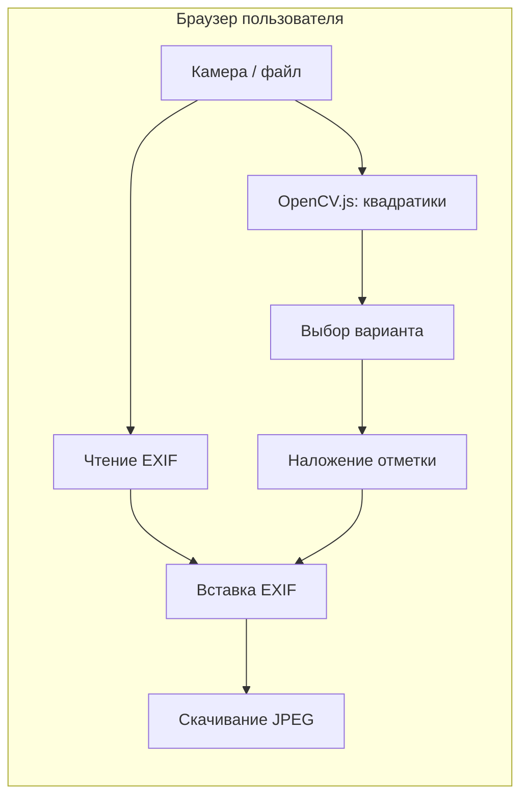

# План реализации Golosuy (обзор)

## Планы по этапам

| Этап | Статус | Файл |
|------|--------|------|
| 1. Инициализация проекта | выполнен | — |
| 2. Захват изображения | выполнен | [golosuy_etap_02_camera.plan.md](golosuy_etap_02_camera.plan.md) |
| 3. Сохранение EXIF | выполнен (библиотека; экспорт в UI — этап 7) | [golosuy_etap_03_exif.plan.md](golosuy_etap_03_exif.plan.md) |
| 4. Детекция бюллетеня | отложен (фаза 2) | [golosuy_etap_04_doc_detect.plan.md](golosuy_etap_04_doc_detect.plan.md) |
| 5. Детекция квадратиков | pending | [golosuy_etap_05_checkbox_detect.plan.md](golosuy_etap_05_checkbox_detect.plan.md) |
| 6. Наложение отметки | pending | [golosuy_etap_06_mark_render.plan.md](golosuy_etap_06_mark_render.plan.md) |
| 7. UI/UX и пользовательский поток | pending | [golosuy_etap_07_ui_flow.plan.md](golosuy_etap_07_ui_flow.plan.md) |
| 8. Тестирование | частично (EXIF unit-тесты готовы) | [golosuy_etap_08_tests.plan.md](golosuy_etap_08_tests.plan.md) |
| 9. Развёртывание | pending | [golosuy_etap_09_deploy.plan.md](golosuy_etap_09_deploy.plan.md) |

**Решение по этапу 4:** для MVP достаточно детекции квадратиков на оригинальном фото и выбора варианта пользователем. Детекция контура бюллетеня и perspective transform — опциональная фаза 2, если точность квадратиков на реальных фото окажется недостаточной.

---

## Архитектура



Фото **никогда не покидают устройство** — сервер отдаёт только статические файлы приложения.

---

## Стек технологий

| Слой | Технология | Зачем |
|------|-----------|-------|
| Сборка | **Vite** | Быстрая разработка, code-splitting для тяжёлых библиотек |
| UI | **React 19 + TypeScript** | Компонентная структура, типобезопасность |
| Стили | **Tailwind CSS** | Mobile-first UI без лишнего CSS |
| Компьютерное зрение | **OpenCV.js** (lazy load) | Детекция контуров и квадратиков |
| EXIF | **piexifjs** | Извлечение исходного EXIF-блока и вставка в итоговый JPEG без изменений |
| Мобильность | **PWA** (`vite-plugin-pwa`) | Установка на домашний экран, офлайн-оболочка |
| Тесты | **Vitest** + **Playwright** | Unit-тесты CV/EXIF, e2e сценарий камеры |
| Развёртывание | **Cloudflare Pages** / **Docker + nginx** | HTTPS из коробки (обязателен для `getUserMedia`) |

**Почему не сервер:** приватность пользователя; EXIF и изображение остаются локальными.

**Почему OpenCV.js, а не ML-модель на старте:** не нужны обучающие данные; для бюллетеней с чёткими квадратиками контурный анализ достаточен для MVP. ML (ONNX Runtime Web) — опциональная фаза 2, если точность окажется недостаточной.

---

## Структура проекта

```
golosuy/
├── src/
│   ├── components/       # CameraCapture, BallotEditor, OptionList, ResultDownload
│   ├── lib/
│   │   ├── cv/           # checkboxDetect (documentDetect — фаза 2)
│   │   ├── exif/         # preserveExif (без модификации полей)
│   │   ├── render/       # drawMark (галочка / крестик)
│   │   └── pipeline.ts   # оркестрация шагов
│   ├── hooks/            # useCamera, useOpenCV
│   └── App.tsx
├── public/               # иконки PWA, opencv.js
├── Dockerfile            # nginx:alpine, статика (этап 9)
├── docker-compose.yml
├── vite.config.ts
└── README.md
```

---

## Риски и митигация

| Риск | Митигация |
|------|-----------|
| OpenCV.js тяжёлый (~8 МБ) | Lazy load, кэш Service Worker (PWA) |
| Плохое освещение / блики | Подсказки пользователю; ручной выбор квадратика тапом |
| EXIF теряется при `canvas.toBlob` | Вставка оригинального EXIF-блока через piexifjs, не re-parse |
| HEIC с iPhone | Конвертация в JPEG; EXIF из HEIC может быть неполным — документировать |
| Safari iOS ограничения canvas | Тестировать `toBlob` quality; fallback `toDataURL` |
| Ложные квадратики в кадре | Кластеризация по колонке; пользователь выбирает из списка/оверлея |
| Сильный наклон фото | Ослабленный фильтр формы; фаза 2 — perspective transform (этап 4) |

---

## Оценка сроков (один разработчик)

| Этап | Оценка |
|------|--------|
| 1–2. Скелет + камера | выполнено |
| 3. EXIF | выполнено |
| 5. CV: квадратики + worker protocol | 4–5 дней |
| 6–7. Отметка + UI + экспорт | 3–4 дня |
| 8–9. Тесты + деплой | 2–3 дня |
| **Итого MVP** | **~2 недели** |

---

## Зависимости (package.json)

```json
{
  "dependencies": {
    "react": "^19",
    "react-dom": "^19",
    "piexifjs": "^1.0.6"
  },
  "devDependencies": {
    "vite": "^6",
    "typescript": "^5",
    "tailwindcss": "^4",
    "@techstark/opencv-js": "^4.10",
    "vite-plugin-pwa": "^0.21",
    "vitest": "^3",
    "@playwright/test": "^1.50"
  }
}
```

OpenCV — через `@techstark/opencv-js`; загружать динамически в Web Worker (`useOpenCV()` + `opencvWorkerClient.ts`).
